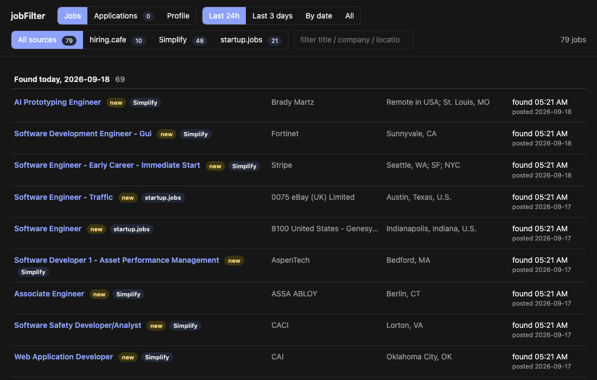
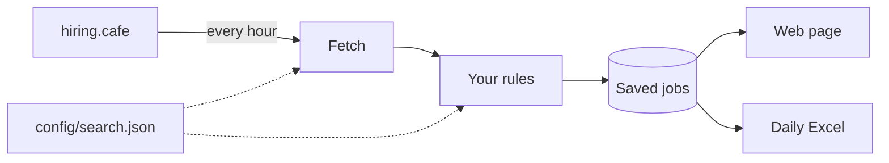
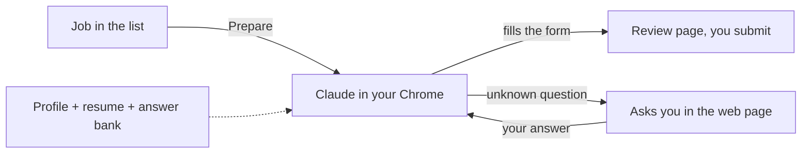

# JobAppBot

Checks [hiring.cafe](https://hiringcafe.com) for new job postings every hour, keeps the ones that match your filters, and shows them in a small web page and an Excel sheet. No more refreshing the site by hand.



## How it works



1. **Fetch**: runs the same search you would type into hiring.cafe (search text, location, "no experience required", posted in the last 2 days, and so on).
2. **Your rules**: drops what the site can't filter out, for example non-software roles, senior titles, or jobs that need a security clearance.
3. **Saved jobs**: every match is stored once. A posting you already saw is never shown as new again.
4. **Web page + Excel**: browse the last 24 hours, pick a day, or open that day's `.xlsx`.

## Setup (macOS or Linux)

```bash
git clone <this repo> && cd JobAppBot
pip install -r requirements.txt
ln -s "$PWD/bin/jobfilter" ~/bin/jobfilter    # any folder on your PATH
jobfilter start                                # hourly scanning is now on
jobfilter ui open                              # opens http://127.0.0.1:8765
```

Needs Python 3.9 or newer.

## Everyday commands

| Command | What it does |
|---|---|
| `jobfilter status` | Is scanning on? When was the last scan? How many jobs? |
| `jobfilter run` | Scan right now and print the new jobs |
| `jobfilter ui open` | Open the web page |
| `jobfilter excel` | Open today's Excel sheet |
| `jobfilter stop` / `jobfilter start` | Pause / resume hourly scanning |
| `jobfilter log` | See what the last scans did |

## Change what you're looking for

Edit `config/search.json`. It has two parts:

- **search_state**: the hiring.cafe search itself. Easiest way to change it: set your filters on hiring.cafe, copy the `searchState=` part of the URL, and paste it in. [config/search.template.json](config/search.template.json) explains every option.
- **rules**: your extra filters (title words to keep or drop, max years of experience, skip clearance jobs, ...).

Then run `jobfilter py validate` to check it, and `jobfilter run` to try it.

## Let Claude fill the application for you

The **Applications** tab in the web page hands a job to Claude, which fills the
form inside your own Chrome window while you watch, and stops on the review
page. You click Submit.



One-time setup:

1. Install the [Claude in Chrome](https://chromewebstore.google.com/detail/claude/fcoeoabgfenejglbffodgkkbkcdhcgfn) extension and sign in with your Claude account (Pro or Max plan).
2. In a terminal run `claude --chrome` once and follow the prompt. This connects the extension to Claude Code.
3. Put your resume PDF in `data/resume/` and fill in the **Profile** tab (address, work authorization, sponsorship answer, and so on).

Then, per job: open it in the Jobs tab, click **Prepare application with Claude**,
and switch to the Applications tab. You will see Claude's steps as they
happen, the questions it could not answer (answer once, it remembers), and
a screenshot of the review page when it is done. Claude pauses for logins,
email codes and CAPTCHAs; the tab is left open for you.

## Where things go

| Path | Contents |
|---|---|
| `data/jobs.db` | all jobs ever matched |
| `data/excel/2026-09-15.xlsx` | one workbook per day |
| `data/scheduler.log` | scan output |
| `data/profile/` | your profile, answer bank, resume text |
| `data/apply/<job>/` | Claude's log and review screenshot per application |

All of `data/` stays on your machine and is not committed.

---

Technical details (how the fetch works, config reference, service internals, module layout): [jobFilter/README.md](jobFilter/README.md).
