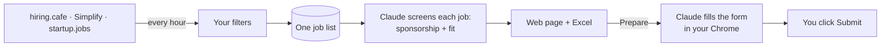

# JobAppBot

Finds new-grad software jobs every hour, checks whether each employer is likely to sponsor a visa, and lets Claude fill the application in your own Chrome. You review and click Submit.


## How it works



1. **Find**: three sources are searched with your filters; each job is stored once.
2. **Screen**: a small Claude model reads the posting and looks up the company's H-1B history. Each job gets a badge: `sponsor: likely`, `unknown`, or `unlikely`, plus a fit score. Tick *hide unlikely sponsors* to see only what's worth your time.
3. **Apply**: click *Prepare application with Claude*. It fills the form in your Chrome, asks you when it can't answer something, and stops on the review page.

Everything runs on your Claude subscription. No API key.

## Quick start

```bash
git clone <this repo> && cd JobAppBot
pip install -r requirements.txt
ln -s "$PWD/bin/jobfilter" ~/bin/jobfilter        # any folder on your PATH

cp setup/search.template.json setup/search.json    # your search (default: new-grad SWE, US)
cp setup/profile.template.json setup/profile.json  # your details for application forms
mkdir -p setup/resume && cp ~/Downloads/Resume.pdf setup/resume/

jobfilter start          # hourly scanning + screening is now on
jobfilter ui open        # http://127.0.0.1:8765
```

To let Claude work in your browser (one time): install the [Claude in Chrome](https://chromewebstore.google.com/detail/claude/fcoeoabgfenejglbffodgkkbkcdhcgfn) extension, run `claude --chrome` once in a terminal, and fill in the **Profile** tab. The Applications tab shows a check mark for each step. macOS and Linux, Python 3.9+.

## Daily use

| Command | What it does |
|---|---|
| `jobfilter ui open` | open the web page |
| `jobfilter status` | is it running, when was the last scan, how many jobs |
| `jobfilter run` | scan right now |
| `jobfilter excel` | open today's Excel workbook |
| `jobfilter stop` / `start` | pause / resume |
| `jobfilter log` | what the last scans did |

**On the web page**
- *Jobs*: pick a source tab or all; rows are grouped by the day they were found. Open a row to see the screening reasoning, then *Prepare application with Claude*.
- *Applications*: watch Claude work, answer the questions it parks for you (they're remembered), open the tab and press Submit, mark it submitted.
- *Profile*: edit your details and the answer bank.

When Claude hits an account sign-up (Workday and similar), it fills your email and hands over: you pick Chrome's *Use strong password*, click Create Account, then press *Run again*.

## Files

| Path | What |
|---|---|
| `setup/` | your search, profile, answers, resume. Not committed; only the templates are. |
| `data/jobs.db` | every job, screening result, and application |
| `data/excel/<date>.xlsx` | daily workbook, one sheet per source |
| `data/apply/<job>/` | Claude's log and review screenshot per application |
| `.claude/skills/apply-job/SKILL.md` | how Claude fills forms; it appends what it learns after each run |

Tuning (search filters, which sources, screening model, jobs per scan) is all in `setup/search.json`; the template explains each key.

---

Technical details: [jobFilter/README.md](jobFilter/README.md). Search parameter reference: [docs/SEARCH_OPTIONS.md](docs/SEARCH_OPTIONS.md).
