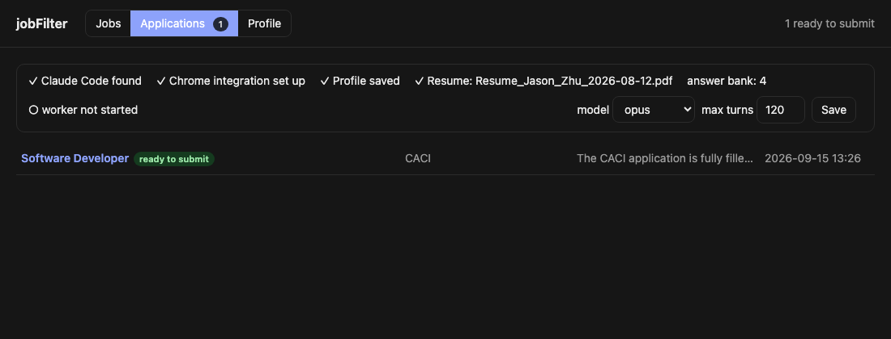
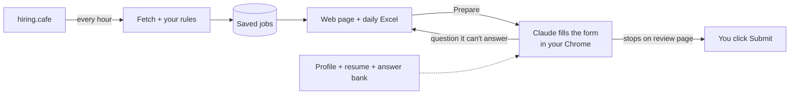

# JobAppBot

Finds new job postings on [hiring.cafe](https://hiringcafe.com) every hour, keeps the ones that match your filters, and lets Claude fill the application forms in your own Chrome while you watch. You only click Submit.



## What it does



1. **Find**: runs your hiring.cafe search (for example "software engineer, no experience required, US, posted in the last 2 days") and drops what the site can't filter: non-software roles, senior titles, clearance jobs.
2. **Collect**: every match is saved once. You browse them by day in the web page or in a daily Excel file.
3. **Apply**: click *Prepare application with Claude* on a job. Claude opens the apply page in your Chrome, creates an account if needed, uploads your resume, fills every field from your profile, answers the custom questions, and stops on the review page. It never presses Submit.

## Setup

```bash
git clone <this repo> && cd JobAppBot
pip install -r requirements.txt
ln -s "$PWD/bin/jobfilter" ~/bin/jobfilter    # any folder on your PATH
jobfilter start                                # hourly scanning is now on
jobfilter ui open                              # opens http://127.0.0.1:8765
```

Works on macOS and Linux, Python 3.9 or newer.

Everything personal lives in one folder, `setup/`, so your search, profile,
answers and resume are in one place. They are gitignored; only the templates are tracked:

| File | What | Start from |
|---|---|---|
| `setup/search.json` | the hiring.cafe search and your rules | `setup/search.template.json` |
| `setup/profile.json` | facts Claude uses to fill forms | `setup/profile.template.json` |
| `setup/answers.json` | answer bank, grows as you answer questions | empty |
| `setup/resume/*.pdf` | the resume to upload | |

### Enable Claude in your browser (one time)

1. Install the [Claude in Chrome](https://chromewebstore.google.com/detail/claude/fcoeoabgfenejglbffodgkkbkcdhcgfn) extension and sign in with your Claude account. A Pro or Max plan is enough; no API key is used.
2. In a terminal run `claude --chrome` once and accept the prompt. This connects the extension to Claude Code.
3. Put your resume PDF in `setup/resume/`.
4. Open the **Profile** tab in the web page (it edits `setup/profile.json`) and fill in what a form usually asks and a resume doesn't have: address, phone, work authorization, your sponsorship answer, EEO choices, earliest start date.

The banner at the top of the **Applications** tab shows a check mark for each of these once it's ready.

## Automatic sponsorship screening

After every hourly scan, each new job is screened by a small Claude model
(Sonnet, on your subscription, no API key). It reads the posting, web-searches
the employer's H-1B history, and writes a verdict you can see in the list:

| Badge | Meaning |
|---|---|
| sponsor: likely · fit 8 | posting says it sponsors, or the company files H-1Bs regularly and the role is new-grad level |
| sponsor: unknown | nothing stated and no clear history |
| sponsor: unlikely | posting says no sponsorship, requires citizenship or a clearance, or the company has no filing history |
| unscreened | not screened yet (the next scan will do it, or click *Screen now* in the job) |

Open a job to read the reasoning: the quoted sentences from the posting, the
company facts with sources, and the fit score. Tick **hide unlikely sponsors**
to review only what's worth applying to. Each company's history is looked up
once and reused for a month, so most screenings take under 30 seconds.

Settings live in the `screening` block of `setup/search.json` (model, jobs per
scan, on/off). `jobfilter py screen` runs it by hand.

## Applying with Claude

1. **Jobs** tab: open a job, click **Prepare application with Claude**.
2. **Applications** tab: the job appears as *queued*, then *Claude is working*. A Chrome tab group opens and you can watch Claude click and type. The log under the job shows every step.
3. Claude ends in one of these states:

| Status | What it means | What you do |
|---|---|---|
| ready to submit | everything is filled, review page is open | check the screenshot or the tab, press Submit, click *Mark submitted* |
| needs your answer | a question wasn't covered by your profile | type the answer in the card; Claude continues by itself. The answer is saved and reused next time |
| needs login / code | an email verification code or a login wall | finish that step in the tab, then *Run again* |
| CAPTCHA | a human check | solve it in the tab, then *Run again* |
| already applied | the site says you applied before | nothing |
| failed | see the log | *Run again*, or *Skip* |

Applications run one at a time. Queue several and come back later.

**Model**: the dropdown in the Applications banner picks which Claude model fills forms (default `opus`). *Max turns* caps how long one run may go. Both apply to the next run.

**Answer bank** (Profile tab): every question you answer once is remembered. You can also add answers ahead of time, for example "Why do you want to work here?" or your salary expectation.

**The skill learns.** How to handle each application system (Eightfold, Workday, Greenhouse, ...) is written down in [.claude/skills/apply-job/SKILL.md](.claude/skills/apply-job/SKILL.md). Claude reads it before every run, and after each run it appends anything new it found out about that site to the "Learned from runs" section. Skim that section now and then and fold recurring notes into the site sections.

## Everyday commands

| Command | What it does |
|---|---|
| `jobfilter status` | Is scanning on? When was the last scan? How many jobs? |
| `jobfilter run` | Scan right now and print the new jobs |
| `jobfilter ui open` | Open the web page |
| `jobfilter excel` | Open today's Excel sheet |
| `jobfilter stop` / `jobfilter start` | Pause / resume hourly scanning |
| `jobfilter log` | See what the last scans did |
| `jobfilter py apply list` | Application statuses in the terminal |
| `jobfilter py screen --limit 20` | Screen unscreened jobs now (also `--job <id>` to redo one) |

## Where the jobs come from

Three sources feed the same database and the same page; a job that shows up in
several is stored once (matched by apply link, then by company + title). On the
Jobs tab, pick **All sources** or one source with the tabs at the top; rows are
grouped by the day they were found and show the found time next to the posting
date, so a day's new arrivals are easy to review. The daily Excel has an `all`
sheet plus one sheet per source.

| Source | What it adds | Notes |
|---|---|---|
| hiring.cafe | the broad search you configured | can lag days behind a company's own board |
| SimplifyJobs New-Grad list | curated new-grad roles, updated several times a day | machine-readable, fastest for big-company postings |
| startup.jobs | startup roles | mostly senior and international; your rules keep the US early-career ones |

Turn any of them on or off, or tune them, in the `sources` block of
`setup/search.json` (explained in the template). Company-specific feeds
(Workday, Greenhouse, ...) can be added the same way later.

## Change what you're looking for

Edit `setup/search.json`. It has two parts:

- **search_state**: the hiring.cafe search itself. Easiest way to change it: set your filters on hiring.cafe, copy the `searchState=` part of the URL, and paste it in. [setup/search.template.json](setup/search.template.json) explains every option.
- **rules**: your extra filters (title words to keep or drop, max years of experience, skip clearance jobs, ...).

Then run `jobfilter py validate` to check it, and `jobfilter run` to try it.

## Where things go

| Path | Contents |
|---|---|
| `data/jobs.db` | all jobs (from every source) and applications |
| `data/excel/2026-09-15.xlsx` | one workbook per day |
| `setup/` | your search, profile, answer bank, resume (gitignored, templates tracked) |
| `data/profile/` | resume text cache, model setting |
| `data/apply/<job>/` | Claude's log and the review screenshot for each application |
| `data/scheduler.log` | scan output |

All of `data/` stays on your machine and is not committed. Your profile is sent to Claude only when it fills a form, together with the job page.

---

Technical details (how the fetch works, config reference, apply engine, service internals): [jobFilter/README.md](jobFilter/README.md). Background on the automation design: [docs/APPLY_AUTOMATION.md](docs/APPLY_AUTOMATION.md).
