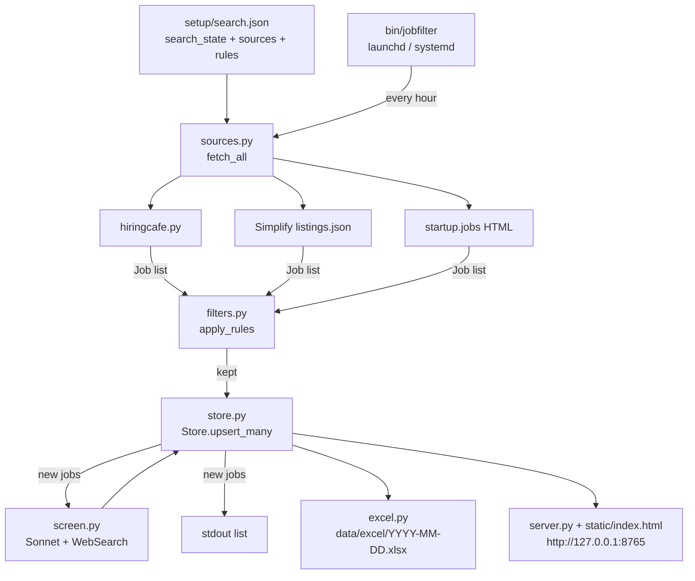

# jobFilter internals

Technical companion to the top-level README.

## Pipeline



## Sources (`sources.py`)

`fetch_all(cfg)` runs every enabled source and returns one list of `Job`s,
each tagged with `via`:

| via | Fetcher | Mechanism | Fields it cannot fill |
|---|---|---|---|
| `hiringcafe` | `fetch_hiringcafe` | the client below | |
| `simplify` | `fetch_simplify` | `listings.json` from SimplifyJobs/New-Grad-Positions (`dev` branch), ETag-cached in `data/cache/`; filtered to `active`, chosen categories, `max_age_days` | min YoE, clearance (set to "Other" when the list says citizenship is required), workplace type |
| `startupjobs` | `fetch_startupjobs` | HTML of `startup.jobs/roles/<slug>?page=N`; cards parsed via their `data-post-template-target` attributes; stops when a whole page is older than `max_age_days` | min YoE, clearance; country guessed from the location text |

Category mapping for the `require_categories` rule: Simplify `Software` and
`Software Engineering` -> `Software Development`, `AI/ML/Data` -> `Data and
Analytics`, `Hardware` -> `Engineering`; startup.jobs engineer/developer role
slugs -> `Software Development`. Countries are guessed from location strings
(`guess_countries`); for Simplify a bare "Remote" counts as US.

Cross-source dedup lives in `Store.upsert_many`: a job is a repeat if its id,
hiring.cafe dedup cluster, normalized apply URL (`Job.norm_url`, tracking
params stripped) or normalized company+title+location (`Job.norm_key`) already
exists. Location is part of the key because the same title in two cities is
two positions; `NORM_KEY_VERSION` in `store.py` (stored as SQLite
`user_version`) forces a recompute of stored keys when the formula changes.
The `jobs` table has `via`, `norm_url`, `norm_key` columns (added by
`Store._migrate` on older databases). A source that throws is logged and
skipped; the scan continues with the others. The `sources` block of
`setup/search.json` overrides `DEFAULT_SOURCES`.

## How the fetch works

hiring.cafe has no public API and sits behind a Cloudflare managed challenge
that blocks plain `requests`/`curl`. Two things make it scriptable:

1. `curl_cffi` with a Chrome TLS fingerprint (`impersonate="chrome"`) passes
   the challenge without a browser.
2. Search results are server-rendered by Next.js. The `searchState` JSON from
   the site URL is sent to `/_next/data/<buildId>/index.json?searchState=...&page=N`
   with header `x-nextjs-data: 1`; the response's `pageProps` has `ssrHits`,
   `ssrTotalCount`, `ssrIsLastPage`. `buildId` is read from the homepage's
   `__NEXT_DATA__` and refreshed when the data route stops answering; the
   HTML page is the fallback.

Each hit carries hiring.cafe's own enrichment under `v5_processed_job_data`:
`job_category`, `min_industry_and_role_yoe`, `security_clearance`,
`visa_sponsorship`, `workplace_countries`, `formatted_workplace_location`,
`estimated_publish_date`, compensation, `technical_tools`,
`requirements_summary`. Full descriptions are available separately from
`/api/job-description?id=<objectID>` (`HiringCafeClient.job_description_text`,
currently unused). Location objects come from
`/api/searchLocation?query=<text>`.

Without an explicit `locations` entry the site adds the country it guesses
from the caller's IP, which is why the config pins the United States.

## Config

`setup/search.json`:

- `search_state`: passed to hiring.cafe verbatim (keys starting with `_` are
  stripped). `schema.py` holds the 95 valid keys and the enumerated option
  strings, extracted from the site's JS bundle; `python -m jobFilter validate`
  checks a config against it. Human-readable reference:
  [../docs/SEARCH_OPTIONS.md](../docs/SEARCH_OPTIONS.md).
- `rules`: local filters in `filters.py`. Each rule is a function
  `(Job, rules) -> rejection reason | None`; add one and append it to `RULES`.

| Rule | Field used |
|---|---|
| `require_countries` | `workplace_countries` |
| `require_categories` | `job_category` |
| `title_include` / `title_exclude` | title, case-insensitive substring |
| `max_min_yoe` | `min_industry_and_role_yoe` |
| `exclude_security_clearance` | `security_clearance != "None"` |
| `max_age_hours` | `estimated_publish_date_millis` |
| `infer_yoe_from_description` | for these sources (default `startupjobs`), when `min_yoe` is unknown the posting text is fetched (`descriptions.fetch_description`) and `infer_min_yoe` extracts the smallest "N years ... experience" figure; a new-grad phrase counts as 0. Then `max_min_yoe` is re-applied |
| `require_stated_yoe` | drop jobs from these sources whose posting states no experience requirement at all |

The `visa_sponsorship` flag is exposed but never filtered on: it is `false`
for most postings, including companies that do sponsor.

## Storage

SQLite at `data/jobs.db` (`store.py`).

- `jobs`: one row per posting that passed the rules. `id` is hiring.cafe's
  `objectID`; `dedup_key` is its `strict_dedup_cluster_id`. A job is new only
  if neither matches an existing row; otherwise `last_seen` and `seen_count`
  are updated. `first_seen_date` (local date) drives the daily views.
  `job_json` holds the normalized `Job` dict.
- `runs`: one row per scan with fetched / kept / new counts and the search
  state used.

Daily workbook: `run` regenerates `data/excel/<today>.xlsx` from all jobs
first seen today, so repeated scans keep one file per day.

## CLI

```
python -m jobFilter run [URL] [--no-rules] [--no-store] [--new-only] [--xlsx PATH] [--max-pages N]
python -m jobFilter validate
python -m jobFilter list  [--since HOURS | --date YYYY-MM-DD]
python -m jobFilter excel [--since HOURS | --date YYYY-MM-DD] [--out PATH]
python -m jobFilter serve [--host 127.0.0.1] [--port 8765]
python -m jobFilter schedule [--interval 3600] [--wait]
```

Bare `python -m jobFilter` is `run`. A pasted hiring.cafe URL replaces the
config's `search_state`.

## Web UI

`server.py` is a stdlib `ThreadingHTTPServer`. The frontend separates markup
(`static/index.html`), behavior (`static/app.js`) and styles (`static/styles.css`).

| Endpoint | Returns |
|---|---|
| `GET /` | the page |
| `GET /static/app.js`, `/static/styles.css` | frontend assets |
| `GET/POST /api/screening-settings` | independent screening provider settings |
| `POST /api/bridge/start` | start the managed GPT browser |
| `GET /api/jobs?since=24` | jobs first seen in the last N hours |
| `GET /api/jobs?date=YYYY-MM-DD` | jobs first seen that local day |
| `GET /api/jobs` | everything |
| `GET /api/dates` | `[{date, count}]` |
| `GET /api/job?id=` | one row |
| `GET /api/runs` | recent scans |
| `GET /api/engine` | readiness, settings, counts |
| `GET /api/applications?status=` | application queue |
| `GET /api/application?id=` | one application with questions and log tail |
| `POST /api/applications/queue` `{job_id}` | queue a job (starts the worker) |
| `POST /api/applications/status` `{job_id,status,note}` | manual status change |
| `POST /api/applications/retry` `{job_id}` | re-queue |
| `POST /api/questions/answer` `{id,answer,save}` | answer a parked question; re-queues when none are open |
| `GET/POST /api/profile`, `/api/settings`, `/api/answers` | profile, engine settings, answer bank |
| `GET /api/file?path=` | screenshot/log files under `data/apply` |

The page supports `#jobs`, `#apps`, `#profile`, `#settings` deep links. The Jobs tab has a
source selector (All / hiring.cafe / Simplify / startup.jobs, remembered in
localStorage) and groups rows by `first_seen` day; `list --source X` and the
per-source Excel sheets are the CLI/file equivalents.

## Background services (`bin/jobfilter`)

The script resolves its own real path, so a symlink from anywhere works. It
writes service definitions from the current `python3` and repo paths on every
`start`, then hands them to the OS service manager:

| | macOS | Linux |
|---|---|---|
| scan | `~/Library/LaunchAgents/com.jobfilter.hourly.plist`, `StartInterval` | `~/.config/systemd/user/jobfilter-scan.{service,timer}`, `OnUnitActiveSec` |
| UI | `com.jobfilter.ui.plist`, `KeepAlive` | `jobfilter-ui.service`, `Restart=always` |
| control | `launchctl bootstrap/bootout gui/$UID` | `systemctl --user enable/disable --now` |

The scan is a short-lived process each tick (about 10 s), so its status reads
"idle" between runs; the UI is a persistent server. The interval lives in
`data/.interval`. `JOBFILTER_PYTHON` and `JOBFILTER_UI_PORT` override the
interpreter and port. On Linux, `loginctl enable-linger $USER` keeps the user
session (and the timer) alive after logout.

Verified on macOS 15 and Ubuntu 22.04 / Python 3.9 (systemd user session in
a container).

## Screening (`screen.py`)

Post-fetch step in `run` (skip with `--no-screen`) and the `screen` command.
For each unscreened job (`Store.unscreened`, capped by `screening.max_per_run`):

1. `descriptions.fetch_description` gets plain text without an LLM where an API exists:
   hiring.cafe description endpoint, Workday `/wday/cxs/<tenant>/<site>/job/...`,
   Greenhouse boards API, Lever postings API, Ashby job-board API,
   SmartRecruiters postings API, startup.jobs JobPosting JSON-LD. Otherwise the
   model is told to WebFetch the apply URL.
2. `run_claude` calls `claude -p --model sonnet --allowedTools WebSearch WebFetch --json-schema SCHEMA --output-format json`
   (headless, subscription login, `--max-turns 14`). The prompt asks for what
   the posting states (`statement`), citizenship/clearance requirements, the
   employer's H-1B history (`company_verdict` with dated counts and URLs),
   new-grad fit and an overall `verdict`/`fit_score`.
3. Results go to the `screenings` table (one row per job, `status` ok|failed,
   evidence and sources as JSON). The company part is cached in
   `company_sponsorship` keyed by a normalized company name for
   `company_cache_days`; a cached company is passed into the prompt and the
   web search is skipped.
4. `screen_batch` runs a thread pool (`concurrency`) but serializes jobs of the
   same company so the first one fills the cache.

Measured: ~25-35 s and ~$0.17 of subscription usage per job with the search,
~10 s with a cached company. `Store.query` and `/api/jobs` attach the
screening to each row; `POST /api/screen {job_id}` screens one job in a
background thread ("Screen now" button); Excel has Sponsor?/Fit/Screening columns.

## Apply engine (`apply_engine.py`)

`providers.py` defines the two supported engines. The worker dispatches Claude jobs
here and Codex jobs to `bridge_engine.py`, which uses `codex.py` and the persistent
MCP browser in `bridge.py`. `application_state.py` owns the shared result schema and
artifact directory, plus atomic Codex claim/completion checks. The old manual Codex
queue is migrated in `Store._migrate`; pending manual runs require an explicit retry.
See [Codex setup and flow](../docs/CODEX_INTEGRATION.md).

For Claude, one application = one headless Claude Code run on the user's subscription:

```
claude -p "<task prompt>" --chrome --output-format stream-json --verbose \
       --json-schema '<RESULT_SCHEMA>' --allowedTools mcp__claude-in-chrome Read \
       --add-dir data --max-turns 120 [--resume <session_id>]
```

- `--chrome` routes browser tools through the Claude in Chrome extension, so
  every click happens in the user's visible Chrome (tab group per session).
  Requires the extension and a `/login` subscription session; an API key
  disables the integration.
- The prompt (`build_prompt`) contains the job, the full text of the
  `apply-job` skill (`.claude/skills/apply-job/SKILL.md`: workflow, per-site
  notes, learned lessons), the profile JSON, the answer bank, the resume text
  and path, and the user's rules (never Submit, don't guess, stop on
  CAPTCHA/login). The skill is also discoverable by interactive Claude Code
  sessions in this repo. `--json-schema` forces the final answer into
  `RESULT_SCHEMA`: `status` in {review_ready, needs_answer, needs_login,
  captcha, already_applied, failed}, `summary`, `page_url`,
  `unanswered_questions[]`, `screenshot_path`.
- The result's `lessons[]` (new reusable facts about the site) are appended to
  the skill's "Learned from runs" section with date and company; exact
  duplicates are skipped, paraphrases are not, so prune by hand occasionally.
- The screenshot Claude reports (a temp jpg from the extension) is copied by
  the engine into `data/apply/<job>/review.*`; Claude is told not to copy
  files itself because headless runs have no Bash permission.
- `stream-json` events are turned into a readable log at
  `data/apply/<job>/log.txt` (`[claude]` text, `[tool]` calls, `[result]`).
  The UI tails it.
- Unanswered questions go to the `questions` table. When the user answers
  them (UI or API), they are appended to the answer bank and the application
  is re-queued; the worker then resumes the same session with
  `--resume <session_id>` and a message containing the answers.
- `ApplyWorker` is a daemon thread inside the web server that processes the
  `applications` queue one at a time; `python -m jobFilter apply worker` runs
  the same loop in the foreground.

State machine per application:

```
queued -> running -> review_ready | needs_answer | needs_login | captcha | already_applied | failed
needs_answer --(all questions answered)--> queued (resume)
review_ready --(user)--> submitted;  any --(user)--> skipped;  failed --(user)--> queued
```

Settings: `data/profile/settings.json` holds `model` (default `opus`; any
Claude Code alias or model ID) and `max_turns` (default 120). They are edited
from the Applications banner (`GET/POST /api/settings`) and read at the start
of each run. `JOBFILTER_MODEL` / `JOBFILTER_MAX_TURNS` env vars override the
file; `JOBFILTER_CLAUDE` overrides the binary (default: `claude` on PATH, else
the newest VS Code extension bundle). Engine readiness is reported by
`GET /api/engine` and shown as the banner in the Applications tab.

Verified: headless `claude -p --chrome` with `--allowedTools mcp__claude-in-chrome Read`
loads 22 browser tools (navigate, read_page, find, form_input, file_upload,
screenshot, ...) and runs with no permission prompts.

## Layout

```
jobFilter/sources.py       hiring.cafe / Simplify / startup.jobs fetchers, fetch_all
jobFilter/hiringcafe.py    client: Cloudflare-passing session, paging, descriptions
jobFilter/schema.py        valid searchState keys/options, validate()
jobFilter/models.py        Job dataclass normalized from a hit
jobFilter/filters.py       rule functions
jobFilter/store.py         SQLite store, dedup, date queries
jobFilter/excel.py         openpyxl writer
jobFilter/server.py        JSON API + static page
jobFilter/static/index.html  page markup
jobFilter/static/app.js     frontend behavior
jobFilter/static/styles.css frontend styling
jobFilter/scheduler.py     foreground interval loop
jobFilter/profile.py       setup/profile.json, setup/answers.json, resume text
.claude/skills/apply-job/  the form-filling skill Claude follows and extends
setup/                     user setup (gitignored) + tracked templates
jobFilter/descriptions.py  description fetchers per ATS + years-of-experience inference
jobFilter/screen.py        post-fetch LLM screening (sponsorship + fit), company cache
jobFilter/providers.py     application engine definitions and validation
jobFilter/application_state.py result schema, artifacts, atomic Codex claims
jobFilter/apply_engine.py  provider dispatch, Claude runner, worker thread
jobFilter/bridge_engine.py Codex application workflow
jobFilter/bridge.py        managed Playwright MCP browser
jobFilter/codex.py         subscription-backed Codex CLI runner
jobFilter/cli.py           argparse entry point
bin/jobfilter              service control script
docs/                      SEARCH_OPTIONS.md, design notes, screenshots
docs/ui.png                screenshot used by the README
```
